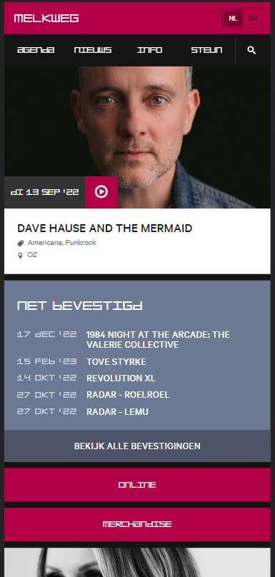
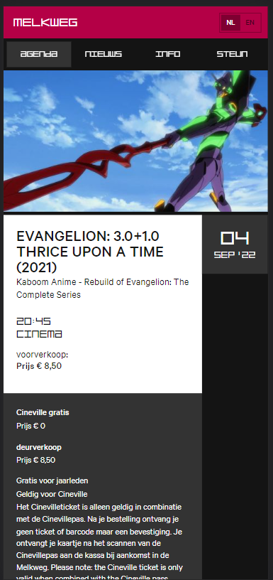

# Procesverslag
Markdown is een simpele manier om HTML te schrijven.  
Markdown cheat cheet: [Hulp bij het schrijven van Markdown](https://github.com/adam-p/markdown-here/wiki/Markdown-Cheatsheet).

Nb. De standaardstructuur en de spartaanse opmaak van de README.md zijn helemaal prima. Het gaat om de inhoud van je procesverslag. Besteedt de tijd voor pracht en praal aan je website.

Nb. Door *open* toe te voegen aan een *details* element kun je deze standaard open zetten. Fijn om dat steeds voor de relevante stuk(ken) te doen.

## Jij

  
uitwerken voor kick-off werkgroep

  ### Auteur:
  Kacper Szymanski  

  #### Je startniveau:
  blauw/rood

  #### Je focus:
  surface plane (bling bling)
 

## Je website

  
uitwerken voor kick-off werkgroep

  ### Je opdracht:
  https://www.melkweg.nl/nl/
  https://www.melkweg.nl/nl/agenda/evangelion-3-0-1-0-thrice-upon-a-time-2021-04-09-2022
  #### Screenshot(s) van de eerste pagina (small screen): 
  Melkweg homepage
  

  #### Screenshot(s) van de tweede pagina (small screen):
  Melkweg concert pagina
  
 

## Toegankelijkheidstest 1/2 (week 1)

  
uitwerken na test in 1e werkgroep

  ### Bevindingen
  Lijst met je bevindingen die in de test naar voren kwamen:

  #### Screenreader
  Screenreader duurde lang en was niet snel door te lopen. 

   -------------------------------- --------------------------------
  Gebruiker eerder menu's aangeven, niet alles onnodig laten oplezen

  #### Muis en Toetsenbord 
  Muis en toetsenbord is redelijk goed te doen. Wel soms lastig zichtbaar wat highlighted is. Sommige navigaties duren lang om doorheen te gaan.
 -------------------------------- --------------------------------

  Zichtbaarheid verbeteren van border-box, miss op een of andere manier navigatie sneller laten doorlopen?? 

  #### Motoriek (shocks, elastiekjes)
  Motoriek was redelijk te doen. Sommige knoppen zijn te klein om te klikken en te makkelijk om te missen maar in het algemeen was het doenbaar. 

 -------------------------------- --------------------------------
Sommige knoppen misschien wat groter?
  #### Visueel (brillen, contrast, kleurenblind, dark/light). 
  Kleurenblindheid was perfect door te lopen. Er is een goeie contrast tussen kleuren en niks werd minder duidelijk tijdens het doorlopen van de website. 
  De brillen waren interessanter. Met de blurry bril was niks te lezen totdat je de pagina op 300% zoom doet. 
  Met de center vision blackout bril moest je lezen met je pheriferal vision wat voor mij bijna onmogelijk is. Je pheriferal vision is heel wazig.

   -------------------------------- --------------------------------
   Blurry bril zorgde ervoor dat de site niet te lezen van maar de zoom in browsers zou genoeg moeten zijn om dat op te lossen. Center vision blackout was bizar lastig, maar misschien is een screenreader oplossing dan bruikbaar hiervoor?

<!-- ## Breakdownschets (week 1)

  
uitwerken na afloop 2e werkgroep

  ### de hele pagina: 
  

  ### dynamisch deel (bijv menu): 
  

  ### wellicht nog een dynamisch deel (bijv filter): 
  

 -->

## Voortgang 1 (week 2)

  
uitwerken voor 1e voortgang

  ### Stand van zaken
  hier dit ging goed & dit was lastig (neem ook screenshots op van delen van je website en code)

  ### Agenda voor meeting
  samen met je groepje opstellen

  | student 1      | student 2          | student 3    | student 4        |
  | ---            | ---                | ---          | ---              |
  | dit bespreken  | en dit             | en ik dit    | en dan ik dat    |
  | en dat ook nog | dit als er tijd is | nog een punt | dit wil ik zeker |
  | ...            | ...                | ...          | ...              |

  ### Verslag van meeting
  hier na afloop snel de uitkomsten van de meeting vastleggen

  - punt 1
  - punt 2
  - nog een punt
  - ...

## Voortgang 2 (week 3)

  
uitwerken voor 2e voortgang

  ### Stand van zaken
  hier dit ging goed & dit was lastig (neem ook screenshots op van delen van je website en code)

  ### Agenda voor meeting
  samen met je groepje opstellen

  | student 1      | student 2          | student 3    | student 4        |
  | ---            | ---                | ---          | ---              |
  | dit bespreken  | en dit             | en ik dit    | en dan ik dat    |
  | en dat ook nog | dit als er tijd is | nog een punt | dit wil ik zeker |
  | ...            | ...                | ...          | ...              |

  ### Verslag van meeting
  hier na afloop snel de uitkomsten van de meeting vastleggen

  - punt 1
  - punt 2
  - nog een punt
- ...

## Toegankelijkheidstest 2/2 (week 4)

  
uitwerken na test in 8e werkgroep

  ### Bevindingen
  Lijst met je bevindingen die in de test naar voren kwamen (geef ook aan wat er verbeterd is):

  #### Screenreader
  Hier korte omschrijving (met indien nodig afbeeldingen)

  Hier een omschrijving van hoe het opgelost kan worden (met indien nodig afbeeldingen)

  #### Muis en Toetsenbord 
  Hier korte omschrijving (met indien nodig afbeeldingen)

  Hier een omschrijving van hoe het opgelost kan worden (met indien nodig afbeeldingen)

  #### Motoriek (shocks, elastiekjes)
  Hier korte omschrijving (met indien nodig afbeeldingen)

  Hier een omschrijving van hoe het opgelost kan worden (met indien nodig afbeeldingen)

  #### Visueel (brillen, contrast, kleurenblind, dark/light). 
  Hier korte omschrijving (met indien nodig afbeeldingen)

  Hier een omschrijving van hoe het opgelost kan worden (met indien nodig afbeeldingen)

## Voortgang 3 (week 4)

  
uitwerken voor 3e voortgang

  ### Stand van zaken
  hier dit ging goed & dit was lastig (neem ook screenshots op van delen van je website en code)

  ### Agenda voor meeting
  samen met je groepje opstellen

  | student 1      | student 2          | student 3    | student 4        |
  | ---            | ---                | ---          | ---              |
  | dit bespreken  | en dit             | en ik dit    | en dan ik dat    |
  | en dat ook nog | dit als er tijd is | nog een punt | dit wil ik zeker |
  | ...            | ...                | ...          | ...              |

  ### Verslag van meeting
  hier na afloop snel de uitkomsten van de meeting vastleggen

  - punt 1
  - punt 2
  - nog een punt
  - ...

## Eindgesprek (week 5)

  
uitwerken voor eindgesprek

  ### Je uitkomst - karakteristiek screenshots:
  

  ### Dit ging goed/Heb ik geleerd: 
  Korte omschrijving met plaatjes

  

  ### Dit was lastig/Is niet gelukt:
  Korte omschrijving met plaatjes

  

## Bronnenlijst

  
continu bijhouden terwijl je werkt

  Nb. Wees specifiek ('css-tricks' als bron is bijv. niet specifiek genoeg).

  https://developer.mozilla.org/en-US/docs/Web/CSS/animation-play-state
  https://developer.mozilla.org/en-US/docs/Web/CSS/Using_CSS_custom_properties
 http://gcctech.org/csc/javascript/javascript_keycodes.htm
 https://www.w3schools.com/css/css3_animations.asp
https://developer.mozilla.org/en-US/docs/Web/API/HTMLAudioElement/Audio
https://www.youtube.com/watch?v=VXWvfrmpapI
https://www.youtube.com/watch?v=VXWvfrmpapI
https://css-tricks.com/almanac/
https://css-tricks.com/snippets/css/a-guide-to-flexbox/

